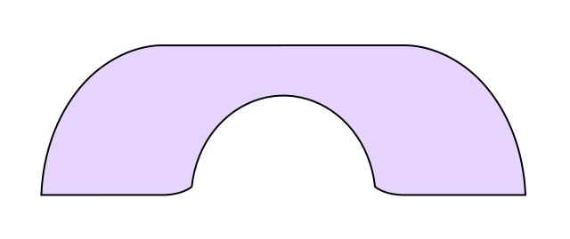

> Note: the following is written in an informal tone with personal opinions. This is not related at all related to the research draft itself.

This vault adheres to a local style of writing Markdown that is transpiled to LaTeX using a niche [piece](https://github.com/jcpaik/mathmd) of software.

# Motivation

LaTeX takes too much mental space for drafting by having to adhere to specific grammars with no proper WYSIWYG support. 

Obsidian checks the mark for the first and the last item, and do have some reference functionality. But it does not have good math environments yet. A perfectionist solution could be to 
1. extend the [CommonMark](https://commonmark.org/) spec very carefully the right way to support theorem environment + cross-references
2. and make a good Obsidian/VSCode plugin or a nice editor to render them correctly in real-time. 
Unfortunately, I'm a PhD student already struggling with a thesis. To this end, I am devising a lazy/minimal grammar of Markdown that renders right away in Obsidian like a basic LaTeX file with theorem environments.

# Spec

The main thing here is a _theorem environment_. It mimics the look of the `amsthm` LaTeX package. We follow the specification of [CommonMark 0.30](https://spec.commonmark.org/0.30/).

> __Definition [theorem-environment].__ A _theorem environment_ is a [block quote](https://spec.commonmark.org/0.30/#block-quotes) that contains the following elements. ^def-theorem-environment
> - Right after the block quote marker, the text ` __EnvType [EnvName].__ ` (including the whitespace at the end) follows. 
> 	- `EnvType` should be one of the followings in the table. 
> 	- `EnvName` can be any name, but it only consists of lowercase alphabets, dash `-`, and should start with an alphabet.
> - Then any contents can be inside the block quote.
> - It should have exactly one [block identifier](https://help.obsidian.md/Linking+notes+and+files/Internal+links#Link+to+a+block+in+a+note) somewhere inside the block quote which is exactly `^EnvAbbr-EnvName`.
> 	- `EnvAbbr` should correspond to `EnvType` as the following table.
> 	- The identifier should be positioned at the very end of a line, with no trailing spaces.

| EnvType    | EnvAbbr  |
|------------|----------|
| Theorem    | thm      |
| Lemma      | lem      |
| Definition | def      |
| Corollary  | cor      |
| Remark     | rem      |
| Figure     | fig      |

_Proof._ A _proof environment_ is simply a series of paragraphs, with the first one starting with `_Proof._`, and the last one ending with the symbol `□` (&#9633). □

> __Figure [sample].__ This is a sample figure. A figure environment should end with a single paragraph of image. ^fig-sample
> 
> 

To refer to a theorem of a figure, we use Obsidian's way to refer a block identifier like [[#^def-theorem-environment]] or [[#^fig-sample]].

## Typing

By typing the environment manually, we fail to solve the problem we had in LaTeX. I use the [obsidian-latex-suite](https://github.com/artisticat1/obsidian-latex-suite) plugin to make them easily typeable. Simply typing `> thm` expands to a `Theorem` environment. Then by typing the name of the environment name, and pressing tab, it autopopulates the name.

# File Structure

- Any directory/file that is a part of the draft should start with `[0-9A][0-9]. ` (including whitespace).

# Drawbacks

This method essentially _constraints_ the way how we use markdown, sacrificing some of its capability. For example, images are always included in figure environment. 