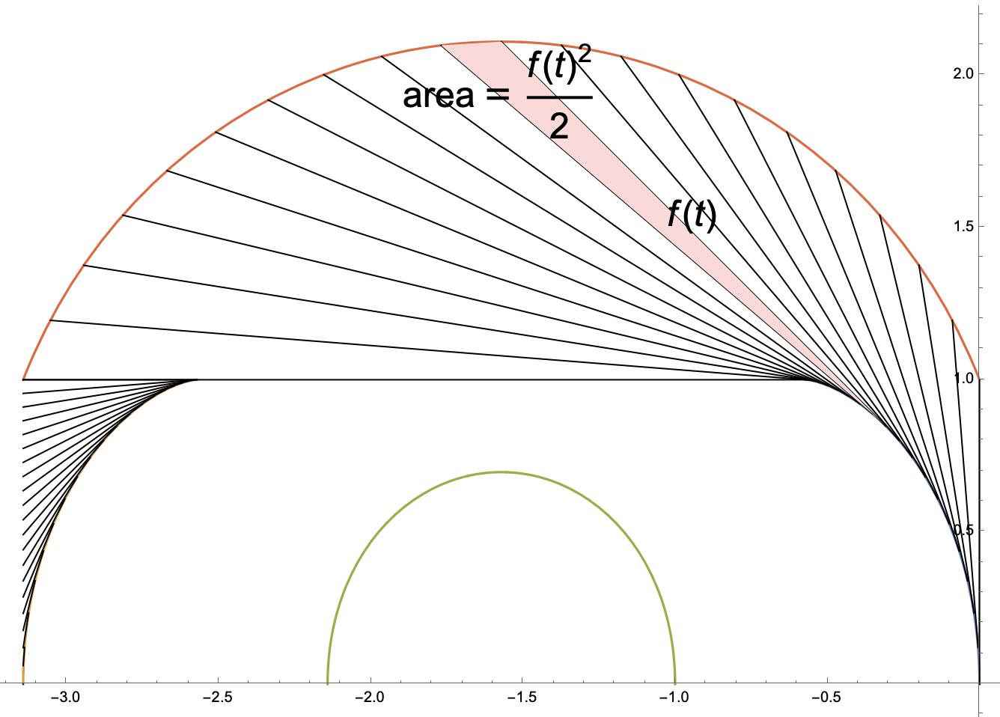

## So far

- Showing that $\mathcal{A}_1$ is a convex function.
> __Figure [mamikon].__  ^fig-mamikon

# Points

- 
- Using piecewise smooth approximation of sofas
	- Polygonal approximation convergence -> Balanced sofa
	- Don't know if balanced sofa forms a piecewise smooth approx.
- Self-loops 