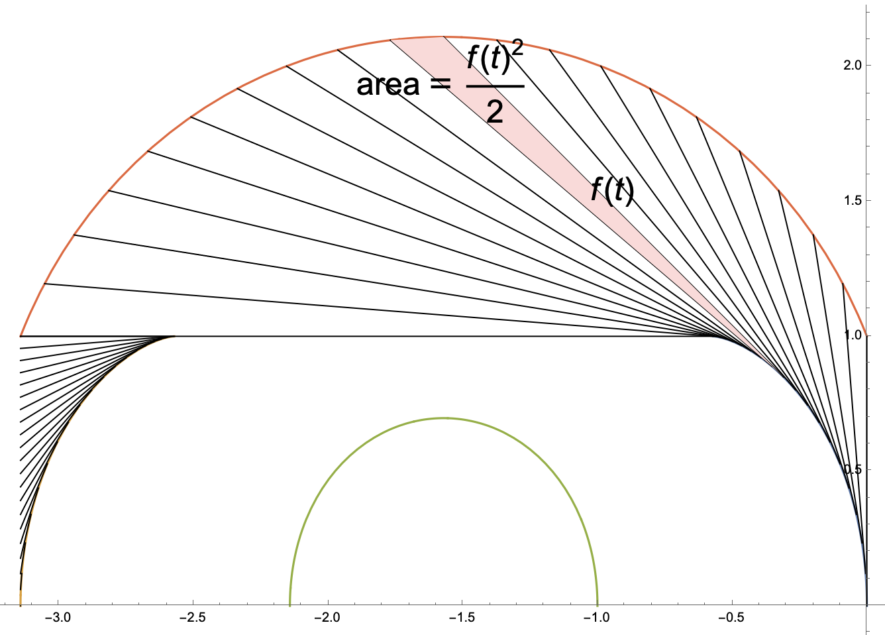

## So far

- Defined what is a cap $K$ and its monotone sofa $\mathcal{M}(K)$
	- Only need to consider monotone sofas
- The space of all caps $K$ forms a convex space
	- and it makes sense to say $K = (1 - \lambda)K_0 + \lambda K_1$ is a cap for $K_0, K_1$ caps.
- $\mathcal{A}(K)$ is the area of $\mathcal{M}(K)$, which is hard to understand.
- Constructed an upper bound functional $\mathcal{A}_1(K) \geq \mathcal{A}(K)$ which has a formula.
- Showed that some cap (presofa) $K_0$ attains a _critical point_ of $\mathcal{A}_1(K)$.
	- For any $K_1$ and $K = (1 - \lambda)K_0 + \lambda K_1$, we have $\left. \frac{d}{d\lambda} \mathcal{A}_1(K) \right|_{\lambda = 0} = 0$.

## Now

- Want to show that presofa $K_0$ attains the _maximum_ of $\mathcal{A}_1(K)$.
- Need to show that $\mathcal{A}_1(K)$ is a concave functional of $K$.
	- If we show the following, then we are done.
	- Here, $a$, $b$ are constants and $f_t(K)$ is linear in terms of $K$.
	- Convex-linearity: $f(K) = \lambda f(K_1) + (1 - \lambda) f(K_0)$
$$
\mathcal{A}_1(K) =  \textrm{some linear term of } K - \int_a^b f_t(K)^2 \, dt
$$
- To generate the 'sum-of-squares' term $\int_a^b f_t(K)^2 \, dt$, we need to use _Mamikon's theorem_
	- The shaded black region is a 'sum-of-squares'
	- Had to formalize this precisely [[x7. Mamikon's Theorem#^thm-mamikon|here]].
> __Figure [mamikon].__  ^fig-mamikon

- The area of the sofa is (some linear function) - (area of black region)
	- This concludes that $\mathcal{A}_1(K)$ is a concave function.